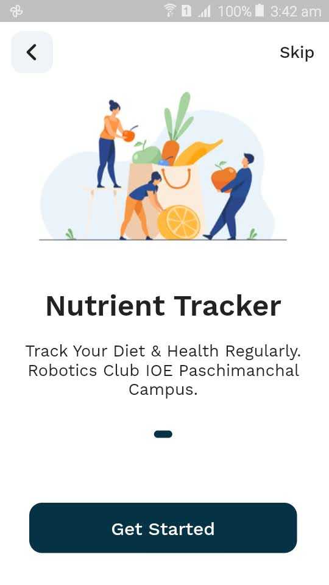
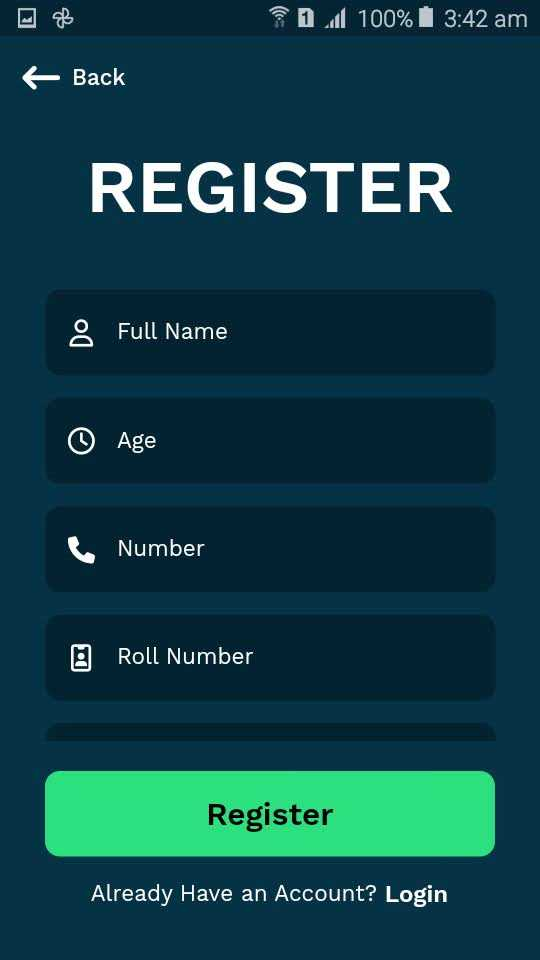

# Nutrients Tracking App

Welcome to the Nutrients Tracking App README! This document will guide you through the installation, usage, and features of our application.

## Table of Contents

1. [Introduction](#introduction)
2. [Installation](#installation)
   - [System Requirements](#system-requirements)
   - [Download and Setup](#download-and-setup)
3. [Usage](#usage)
   - [Getting Started](#getting-started)
   - [Logging Meals](#logging-meals)
   - [Viewing Nutrient Statistics](#viewing-nutrient-statistics)
   - [Setting Goals](#setting-goals)
4. [Features](#features)
   - [Meal Logging](#meal-logging)
   - [Nutrient Analysis](#nutrient-analysis)
   - [Goal Setting](#goal-setting)
   - [Data Visualization](#data-visualization)
5. [Contributing](#contributing)
6. [License](#license)

## Introduction

The Nutrients Tracking App is a user-friendly application designed to help you keep track of your daily nutrient intake. Whether you are managing your diet for health reasons or simply aiming for a more balanced lifestyle, our app provides the tools you need to monitor and achieve your nutritional goals.

## Installation

### System Requirements

Before you begin, please ensure your system meets the following requirements:

- Operating System: Windows 10, macOS, or Linux
- Web Browser: Google Chrome, Mozilla Firefox, or Microsoft Edge
- Internet Connection: Required for initial setup and data synchronization

### Download and Setup

To install the Nutrients Tracking App, follow these steps:

1. Install the application by following the on-screen instructions.

2. Launch the app and create a user account.

3. Configure your profile with relevant information such as age, gender, and dietary preferences.

4. You're ready to start tracking your nutrients!

## Usage

### Getting Started

Upon launching the app, you will be presented with the dashboard. Here's how to get started:

### Logging Meals

To track your nutrient intake, log your meals:

1. Click on the "Log Meal" button.

2. Enter the details of your meal, including food items, quantities, and serving sizes.

3. The app will calculate the nutrient content of your meal and update your daily intake.

### Viewing Nutrient Statistics

Monitor your nutrient intake with ease:

1. Navigate to the "Nutrient Dashboard" to view your daily, weekly, and monthly nutrient consumption.

2. Visualize your progress with interactive charts and graphs.

### Setting Goals

Stay on track by setting personalized nutrient goals:

1. Access the "Goal Settings" section to define your daily nutrient targets.

2. Receive notifications when you approach or meet your goals.

## Features
- [x] Loging UI with otp verification
- [x] Navigation
- [x] Nutrient recommandation
- [ ] Nutrient consumption charts
- [ ] BMI calculation
- [ ] Food macros and micros calculation

### Meal Logging

- Log meals with a comprehensive database of food items and their nutritional information.
- Save your favorite meals for quick entry.
- Track meal history to identify trends and make informed choices.

### Nutrient Analysis

- Monitor your intake of macronutrients (carbohydrates, proteins, fats) and micronutrients (vitamins, minerals).
- Receive real-time feedback on your nutrient balance.
- Easily identify nutrient deficiencies or excesses.

### Goal Setting

- Set and customize daily nutrient goals based on your dietary needs and preferences.
- Track your progress towards meeting your goals.
- Adjust goals as your nutritional requirements change.

### Data Visualization

- Visualize your nutrient intake with charts and graphs.
- Analyze trends in your dietary habits over time.
- Gain insights into your nutritional patterns and areas for improvement.

### ScreenShots
#### Some of Glimpse are given below:

